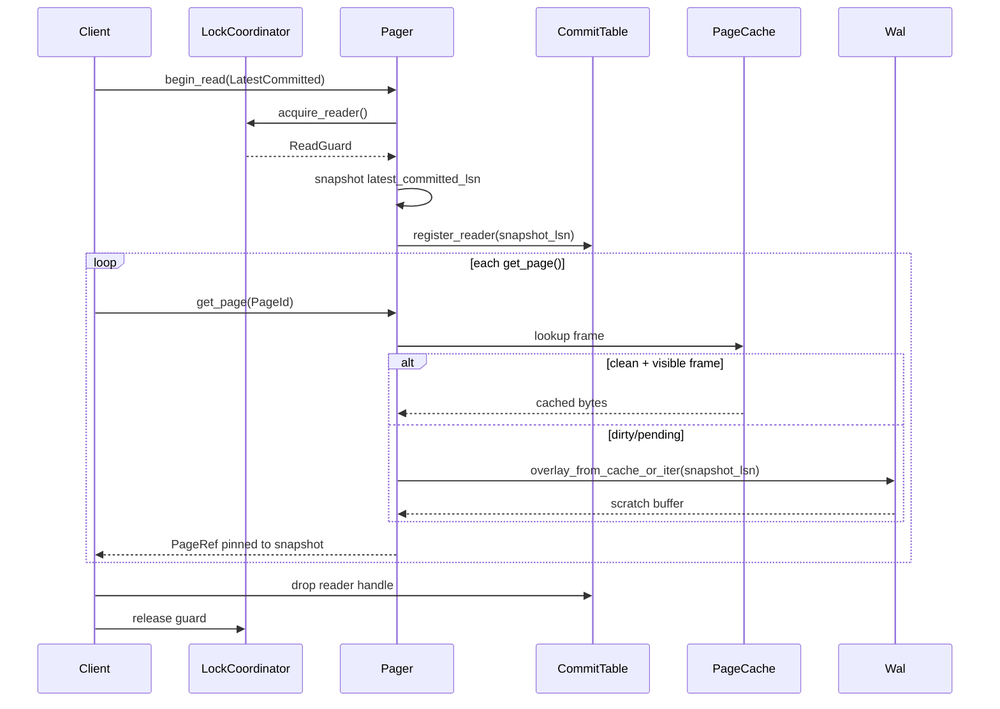
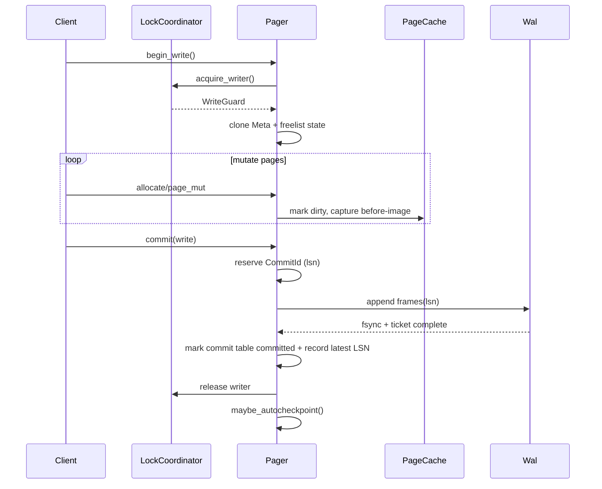
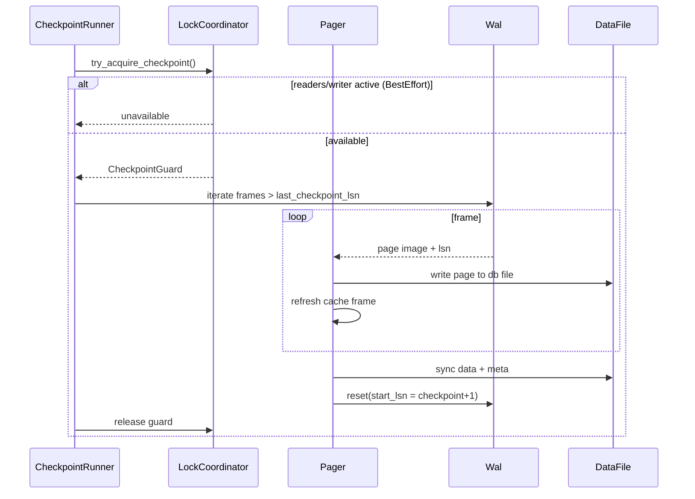

<!-- MVCC baseline survey -->
# Pager & Concurrency Baseline

This note captures the current transaction/locking behavior so we know exactly where MVCC hooks must attach before changing semantics.

## 1. SingleWriter lock coordinator

- File-backed slots (`src/primitives/concurrency/mod.rs`) enforce **single writer / multi reader** discipline plus an exclusive checkpoint slot.
- `acquire_reader`
  - Spins when `checkpoint` flag is up, then grabs the shared reader byte range and increments an in-memory `readers` counter.
  - Readers do *not* block writers; they only block checkpoints (locks are independent).
- `acquire_writer`
  - Waits for `checkpoint` flag to clear, then marks the `writer` flag and obtains the exclusive writer slot.
  - Only one writer is allowed per process; recursive acquisition results in `SombraError::Invalid("writer lock already held")`.
- `try_acquire_checkpoint`
  - Requires **no readers and no writer**. It first grabs the reader slot range in exclusive mode (blocking new readers), then locks the checkpoint slot and flips the `checkpoint` flag. Dropping the guard clears both.

> **Hook point.** Reader and writer guards are purely advisory today; MVCC will need additional metadata (commit IDs, oldest reader tracking) layered next to these acquisitions.

## 2. Read transaction flow

Code path: `Pager::begin_read` ➝ `PageStore::get_page` (`src/primitives/pager/pager.rs:2047` and `:2061`).

1. `begin_read` grabs a `LockReaderGuard` and snapshots `meta.last_checkpoint_lsn` into the `ReadGuard`.
2. `PageStore::get_page`
   - Checks page cache; if a frame is dirty or pending checkpoint, the read is treated as a miss because readers are only allowed to see checkpointed pages.
   - After fetching from disk, it asserts `guard.snapshot_lsn == inner.meta.last_checkpoint_lsn`. If the checkpoint advanced while a reader was active, this debug assertion would trigger—showing that readers are tied strictly to the most recent checkpoint.
3. CRC verification is optional via `checksum_verify_on_read`.

**Implication:** Readers never see WAL-only data. Visibility jumps only when `last_checkpoint_lsn` advances, so current semantics are closer to “snapshot at last checkpoint” than “read committed.”

> **Hook point.** `ReadGuard` needs to learn about “latest committed LSN” and pin that snapshot even as checkpointing catches up. MVCC metadata must also be consulted when populating `PageRef`.

## 3. Write transaction flow

Code path: `Pager::begin_write` ➝ mutation helpers ➝ `Pager::commit_txn`.

1. `begin_write`
   - Acquires the writer slot, clones `Meta`, freelist state, and records empty tracking collections on the `WriteGuard`.
2. Page mutations (`page_mut`, `allocate_page`, `free_page`) mark frames dirty, snapshot original bytes, and enqueue freelist updates while the writer lock is held.
3. `commit_txn`
   - Locks pager state, assigns the next `lsn`, collects dirty pages and the meta page, and builds `PendingWalFrame` objects. Frames are downgraded to read guards so WAL flushing can happen without holding the pager mutex.
   - Depending on whether payloads are “borrowed” (still pointing at cache pages) or owned copies, it either flushes synchronously (borrowed path) or enqueues work on the `WalCommitter` thread pool.
   - The writer lock is released **after** WAL append/enqueue succeeds. Failed commits reacquire the lock before rolling back.
4. Once commit completes, `maybe_autocheckpoint` may trigger `run_checkpoint` asynchronously based on WAL size/time.

**Visibility today:** Even after commit, data is not visible to readers until a checkpoint copies WAL frames back to the main file and updates `last_checkpoint_lsn`.

> **Hook point.** MVCC needs a notion of “committed but not checkpointed” that readers can observe. Candidate locations include `commit_txn` (where LSNs are assigned) and the WAL append path.

## 4. Checkpoint flow

Code path: `Pager::run_checkpoint` ➝ `perform_checkpoint`.

1. Attempts to `try_acquire_checkpoint`. Best-effort mode bails if any reader/writer exists; force mode loops until the guard becomes available.
2. With the guard held, iterates WAL frames newer than `meta.last_checkpoint_lsn`, writing each page back to the main file and refreshing any cached frames.
3. Rebuilds freelists, syncs the data file, bumps `meta.last_checkpoint_lsn` to the highest applied frame LSN, writes/syncs the meta page, and finally resets the WAL so `next_lsn = last_checkpoint_lsn + 1`.
4. Drops the checkpoint guard, allowing new readers/writers.

**Effect on readers:** After `last_checkpoint_lsn` is updated, newly created `ReadGuard`s observe the fresh state; existing readers would have been blocked because checkpoint acquisition required `state.readers == 0`.

> **Hook point.** We need checkpoints to respect version retention: they must not drop WAL segments or free old page versions until all readers referencing older commit IDs finish.

## 5. LSN & visibility timeline

- `inner.next_lsn` increments per commit. The WAL contains the authoritative latest data immediately after commit.
- `meta.last_checkpoint_lsn` lags behind and only advances during checkpoints. It doubles as the “read snapshot” marker today.
- Because `ReadGuard` stores the checkpoint LSN and checkpoints wait for readers, the effective timeline is:

```
Commit N (WAL) --> Readers still see checkpoint LSN M
Checkpoint runs (no readers/writers) --> last_checkpoint_lsn := N
Future readers observe commit N data
```

For MVCC read-committed, we need:

1. A new snapshot source (`latest_committed_lsn`) that can advance without draining readers.
2. Page access logic that can materialize versions newer than the on-disk image, likely replaying WAL or following per-page version chains.

These requirements pinpoint touchpoints in `ReadGuard`, `PageStore::get_page`, `commit_txn`, and `run_checkpoint`.

## 6. Storage mutation entry points

The storage layer wraps pager transactions in `WriteGuard<'_>` handles. Every mutation funnels through a small set of functions—these will need MVCC metadata updates and visibility checks.

### 6.1 Flow table

| Path | Entry points | Components touched today | Pager guard usage | MVCC considerations |
| --- | --- | --- | --- | --- |
| Node insert | `Graph::create_node` (`src/storage/graph.rs:331`) | Node B-tree, `VStore::write` for oversized props, `IndexStore::insert_node_labels`/`insert_property_value`, meta `storage_next_node_id`, metrics | Requires `&mut WriteGuard`, performs `tx.update_meta` and `tx.page_mut` as needed | Need per-record version headers for node rows and index entries; ID allocator likely needs to stamp commit IDs to correlate tombstones |
| Node delete (restrict/cascade) | `Graph::delete_node` (`graph.rs:805`) | Node B-tree delete, adjacency scans via temporary `ReadGuard`, optional cascading `delete_edge`, VStore frees, label + prop index removal | Mixes read snapshot (`store.begin_read`) with write transaction; relies on single-writer to avoid concurrent mutations | MVCC must guarantee cascade sees a consistent set of incident edges; tombstones must mask nodes before adjacency/index cleanup runs |
| Node update | `Graph::update_node` (`graph.rs:858`) | Node row rewrite, property map delta encode, VStore writes/frees, prop index delta application | Entire delta occurs under write guard | Version metadata must cover both row + property map so readers can see before/after values without blocking writers |
| Edge insert | `Graph::create_edge`/`insert_edge_unchecked` (`graph.rs:928`) and `GraphWriter::create_edge` (`graph.rs:1850`) | Edge B-tree, adjacency FWD/REV B-trees, optional degree cache, VStore writes, metrics | Writer guard; adjacency persistence uses transactional batches with rollback on failure | Need version-aware adjacency/index entries so readers skip uncommitted edges but can follow newest committed ones |
| Edge delete | `Graph::delete_edge` (`graph.rs:1150`) | Edge B-tree delete, adjacency removal, VStore free, degree cache decrement | Writer guard only | Requires tombstones + deferred cleanup of adjacency/index rows to keep reads consistent until GC |
| Edge update | `Graph::update_edge` (`graph.rs:1007`) | Edge row rewrite, VStore writes/frees | Writer guard | Similar to node update—must store old + new prop payloads per version |
| Property/index DDL | `IndexStore::{create,drop}_{label,property}_index` (`storage/index/store.rs`) | Index catalog B-tree, label index tree, chunked/btree postings structures, Graph re-scan to backfill | Uses `WriteGuard` because B-tree mutations live on pager pages | Need MVCC gating or metadata so catalog/index readers can tolerate concurrent rebuilds while still observing committed definitions |
| Variable store | `VStore::{write,free}` (`storage/vstore/mod.rs`) | Allocates/frees overflow pages via pager allocator/free list | Called from Graph/props/etc with `&mut WriteGuard` | Overflow chains need version ownership so GC can reclaim only when no reader references the VRef |

### 6.2 Observed invariants & hooks

- **Cross-guard sequencing.** `delete_node` opens a fresh `ReadGuard` to enumerate incident edges before mutating anything. Under MVCC, that read must target the same logical snapshot as the outer write transaction or we risk deleting edges created later.
- **Adjacency/index batches.** Functions like `insert_adjacencies` and `IndexStore::insert_node_labels` assume hard success/failure with immediate rollback. Versioning likely needs idempotent upserts plus “visible at commit” flags so that writes do not surface early to concurrent readers.
- **Meta persistence.** `persist_tree_root` and `tx.update_meta` run inline for almost every mutation, meaning MVCC metadata (commit IDs, version roots) must fit alongside existing meta updates without exploding I/O cost.
- **GraphWriter caching.** `GraphWriter` caches node-existence results across multiple inserts. Once readers can observe uncheckpointed state, we need to specify whether existence probes consult committed-only data or include in-flight writes (currently they use the write guard and therefore see their own uncommitted inserts).

These notes highlight the exact call sites that must gain MVCC awareness (version headers, visibility filters, deferred cleanup) before altering pager semantics.

## 7. WAL layout & metadata slots

### 7.1 File header

- Fixed 32-byte header written by `Wal::open` (`src/primitives/wal/mod.rs:232`).
- Layout: `magic(4) | format(2) | reserved(2) | page_size(4) | wal_salt(8) | start_lsn(8) | crc32(4)`.
- Reserved bytes (`[6..8]`) are currently zeroed—potential place for small feature flags (e.g., “MVCC metadata present”), but too small for IDs.
- `start_lsn` is rewritten when the first frame appended jumps ahead of the initial LSN.

### 7.2 Frame header & payload

- Every frame stores a **full page image** preceded by a 32-byte header:
  - `frame_lsn (8)` – monotonic per commit, identical for all dirty pages in one transaction.
  - `page_id (8)` – absolute page number.
  - `prev_crc32_chain (8)` – chaining value combining previous frame hash and frame size; iterator stops if it does not match.
  - `payload_crc32 (4)` – checksum of the page bytes.
  - `header_crc32 (4)` – checksum of the header itself.
- There are **no unused bytes** inside the frame header; corrupting it prevents recovery.
- Any MVCC metadata must therefore either live:
  1. Inside the page image (e.g., page trailer or record headers), or
  2. As separate “logical pages” in the WAL that encode commit descriptors.

### 7.3 LSN lifecycle & commit batching

- `PagerInner.next_lsn` feeds `WalFrame::lsn` per commit; readers currently only care after checkpoint.
- `Wal::append_frame_batch` enforces `frame.lsn >= start_lsn` and writes contiguous `(header, payload)` slices using `writev`.
- `WalCommitter` coalesces multiple commits before calling `append_frame_batch` and optionally `sync`. Failures bubble back via `WalCommitTicket`.
- `WalIterator` walks frames, validating the CRC chain and halting once corruption or EOF is detected. `perform_checkpoint` stops reading as soon as iterator returns `None`.

### 7.4 Metadata opportunities

| Candidate | Pros | Cons / work needed |
| --- | --- | --- |
| Embed commit metadata in meta page | Already persisted via WAL; easy to checkpoint | Still tied to checkpoint cadence; does not help uncheckpointed readers |
| Extend page layout with per-page MVCC trailer | No WAL format change, piggybacks on existing page images | Consumes page bytes; each page must manage multiple record versions |
| Add “logical metadata frames” (fake page IDs) into WAL | Allows storing commit table, version index, etc. side-by-side with page images | Requires changes to checkpoint replay to understand non-page frames and to ignore them during eviction |
| Use reserved file-header bytes as feature flags | Simple compatibility toggle | Only 2 bytes available; cannot hold commit IDs or timestamps |

Takeaway: WAL format is tight, so MVCC metadata should either piggyback on page payloads or reserve special page ranges whose layout encode version tables. Any new fields must keep the CRC chain intact to avoid confusing `WalIterator`.

## 8. MVCC metadata format (object model)

### 8.1 Commit identifiers

- Introduce `type CommitId = u64` and make it synonymous with pager LSNs for now. Every write transaction receives its `CommitId` when `commit_txn` begins writing WAL frames.
- `CommitId` space is strictly increasing; gaps are acceptable when rollback occurs.
- Commit descriptors are stored both in-memory (commit table) and durably by appending a tiny “metadata frame” to the WAL (see §10.2).

### 8.2 Versioned record envelope

Wrap every logical record (node, edge, adjacency row, property index entry, vstore allocation record) in a fixed header **before** existing payload bytes:

```
struct VersionHdr {
    begin: CommitId;       // first commit where record is visible
    end: CommitId;         // exclusive upper bound; 0 == INF
    flags: u16;            // Tombstone, payload-inline, etc.
    payload_len: u16;      // for fast skipping; 0 == external (VRef/Unit)
}
```

- For node/edge rows the payload is the existing encoded blob. Deletes set `flags |= TOMBSTONE` and leave the payload untouched so GC can reconstruct index entries later.
- For adjacency/index (currently store `Unit` values) we store the header in the value slot and leave keys untouched. Payload length is zero, signaling “value-less record with version envelope only.”
- `payload_len` lets B-Tree leaf scanners skip over old versions quickly even before GC compacts the page.

### 8.3 Structure-specific notes

- **Nodes / edges:** On insert/update we emit a new `VersionHdr` with `begin = writer_commit_id`, `end = 0`. Updates keep the previous version around by simply linking its `end` to the new commit ID. Delete is implemented as a tombstone version.
- **Adjacency + indexes:** Each derived row references the same `VersionHdr` fields as the base record so visibility checks stay consistent. We do *not* try to share storage across trees; instead we recompute `VersionHdr` per tree to keep recovery simple.
- **VStore:** We do not version individual overflow pages. Instead, each `VRef` stored in `VersionHdr` payload carries the owning `begin`/`end` commit IDs. Vacuum frees a `VRef` only after both the referencing record and any newer versions have been retired.
- **Free list / ID allocators:** The freelist B-Tree stays single-versioned, but we add a `meta.oldest_visible_commit` field so checkpoint/vacuum logic knows when pages can be recycled safely.

### 8.4 Page-level version metadata

Per-page copy-on-write (described in the plan) needs a lightweight chain structure:

```
struct PageVersionInfo {
    page_id: PageId,
    commit: CommitId,
    prev: Option<PageVersionPtr>, // older version pointer
    wal_offset: u64,              // byte offset in WAL for replay
    refcount: AtomicU32,          // readers using this version
}
```

- `PageVersionInfo` entries live in an in-memory hash map keyed by `(page_id, commit)`. When a writer dirties a page, it creates a new entry pointing at the WAL address that will contain the committed image.
- The page cache stores only the newest committed image. Older versions are materialized on demand by replaying WAL into a scratch buffer using `wal_offset`.
- Once `refcount` hits zero *and* `commit < oldest_active_commit`, the entry is dropped, freeing WAL retention pressure.

## 9. Commit and visibility rules

### 9.1 Transaction lifecycle

1. **Begin write:** acquire writer lock, mutate pages as today.
2. **Prepare commit:** before flushing WAL frames, reserve a `CommitId = next_lsn` and insert an `Active` entry in the commit table.
3. **WAL flush:** identical to current flow. After frames land durably, update the commit table entry to `Committed { wal_end }`.
4. **Readers:** `ReadGuard::begin` acquires reader lock, samples `latest_committed = commit_table.last_committed_id()`, and stores it alongside a `wal_anchor` (highest WAL byte offset safe to read). Readers never block writers because they operate purely on metadata.
5. **Visibility test:** When reading a record, accept it iff `hdr.begin <= snapshot_commit` and either `hdr.end == 0` or `snapshot_commit < hdr.end`. Tombstones simply hide payloads; GC will later prune them.

### 9.2 Handling deletes and cascades

- Cascading deletes (e.g., `delete_node(DeleteMode::Cascade)`) now execute as:
  1. Start write txn.
  2. Open a *logical* read cursor pinned to the same `CommitId` as the txn’s eventual snapshot to enumerate incident edges. This avoids race conditions where freshly inserted edges disappear mid-scan.
  3. Emit tombstone versions for edges/nodes; physical removal is deferred to vacuum.
- Because there is still only one writer, we can share the same `CommitId` between the main txn and its auxiliary reads.

### 9.3 Interaction with checkpoints

- Checkpoints no longer wait for all readers; they only need the writer slot plus confirmation that `commit_table.min_active() > checkpoint_target`. If a long-running reader pins an older commit, the checkpoint skips WAL frames newer than that commit but can still persist older generations.
- We keep `meta.last_checkpoint_lsn` for on-disk consistency, but `ReadGuard` comparisons switch from `last_checkpoint_lsn` to `latest_committed`.

### 9.4 Recovery semantics

- During WAL replay we reconstruct version headers exactly as they were encoded in page images. Commit descriptors (see below) tell us which `CommitId`s reached `Committed`. Any frame tied to an uncommitted `CommitId` is ignored during recovery, restoring atomicity.

## 10. Commit table and GC integration

### 10.1 In-memory commit table

```
struct CommitEntry {
    id: CommitId,
    state: CommitState, // Active | Committed { wal_end } | Aborted
    oldest_reader: AtomicU32, // refcount of readers pinned here
}
```

- Stored in a ring buffer keyed by `id % capacity`. Writers allocate entries when they reserve an ID; readers increment `oldest_reader` on begin and decrement on drop.
- `CommitTable::last_committed()` returns the highest contiguous `CommitId` whose state is `Committed`.
- `CommitTable::min_active()` walks forward from the oldest entry with `state == Active` or `oldest_reader > 0`. This value gates WAL trimming and vacuum.

### 10.2 Durable metadata frames

- After flushing WAL frames for a transaction we append a tiny **commit descriptor frame** with a reserved `page_id = PageId::MAX`:

```
struct CommitDescriptor {
    commit: CommitId,
    state: u8,           // 1 = committed, 2 = aborted
    page_count: u32,     // dirty pages written in this commit
    reserved: [u8; 19],
}
```

- `perform_checkpoint` skips these frames when copying back to the main file but uses them to rebuild the commit table on recovery.
- Because descriptors live inside WAL, they inherit checksums/CRC chaining automatically.

### 10.3 Vacuum + GC flow

1. Vacuum thread periodically asks the commit table for `cutoff = min_active()`.
2. It scans page-version chains and record headers, freeing any version whose `end != 0 && end <= cutoff`.
3. For tombstones where `begin <= cutoff`, it physically removes the record from the B-Tree and recycles VStore blobs.
4. Once all page versions <= `cutoff` are dropped, checkpoint can safely truncate WAL segments older than the newest surviving `PageVersionInfo`.

### 10.4 Metrics & visibility

- Export `mvcc.latest_committed`, `mvcc.oldest_active`, `mvcc.page_versions`, and `mvcc.vref_backlog`.
- Emit structured logs when `oldest_active` lags `latest_committed` beyond thresholds, signaling reader starvation or vacuum issues.

## 11. Transaction sequence diagrams

The textual flows above are now mirrored as Mermaid diagrams for onboarding and design reviews. They highlight where MVCC hooks attach (commit table queries, version overlays, checkpoint gating).

### 11.1 Read-only (LatestCommitted)



### 11.2 Write transaction



### 11.3 Checkpoint



- MVCC hook: guard acquisition will also consult the commit table (`min_active`) so checkpoints skip WAL ranges still required by readers or version chains.

## 12. WAL crash/replay validation

To prove that WAL replay restores uncheckpointed commits (and future MVCC metadata frames), we added an integration test `tests/integration/wal_crash_replay.rs`:

1. Create a fresh pager on a temp DB, allocate one page, and write a patterned payload.
2. Commit the write without checkpointing; capture the returned `Lsn`.
3. Drop the pager to simulate a crash before checkpoint, ensuring WAL holds the only copy.
4. Re-open the pager via `Pager::open`, which triggers `recover_database`, then issue a `begin_read()` + `get_page()` call.

The test asserts that:

- The reopened reader observes the exact payload despite no checkpoint (proving WAL replay patched the main file).
- `meta.last_checkpoint_lsn` advanced to at least the committed LSN after recovery, so `latest_committed` snapshots inherit those bytes.

Run it in isolation with `cargo test wal_crash_replay`. Once MVCC commit-descriptor frames land, extend this test to parse the logical metadata frames (reserved `page_id`) and confirm they survive crash/replay alongside page images.

## 13. Read snapshot API & guard lifecycle

Latest-committed reads already receive their own `ReadGuard`, but MVCC requires clearer ownership + APIs so higher layers know exactly what is pinned.

### 13.1 Guard creation flow

1. `Pager::begin_snapshot(ReadConsistency::LatestCommitted)` becomes the explicit entry point, wrapping the existing `begin_latest_committed_read` helper.
2. The call acquires the reader lock, samples `latest_committed_lsn`, and registers a `CommitReaderHandle` inside `CommitTable` (already sketched in §10). The handle stores `snapshot_commit` and an opaque token for metrics.
3. `ReadGuard` gains public accessors:
   - `snapshot_commit()` → `CommitId` (alias of LSN) for callers needing to tag cursors, indexes, etc.
   - `consistency()` → `ReadConsistency`, exposing whether the guard pins checkpoint vs latest committed.
   - `wal_anchor()` (optional) capturing the WAL byte offset associated with the snapshot; this enables background WAL trimming to skip frames still needed by active readers.

### 13.2 Guard lifetime semantics

- Dropping `ReadGuard` decrements the commit-table reader count and optionally releases WAL anchors/overlay refcounts.
- Guards are `Send` but not `Sync`; passing across threads transfers ownership of the reader slot explicitly so we can continue to enforce “reader must drop before checkpoint wants a global pause.”
- Attempting to clone or copy a guard is forbidden—callers that need multiple cursors must derive logical handles (e.g., `Arc<SnapshotCtx>`) that own a single guard internally.

### 13.3 Snapshot pinning guarantees

- `Pager::get_page` consults two pieces of metadata per frame:
  1. `frame.dirty && frame.lsn > guard.snapshot_commit()` → requires overlay reconstruction from WAL or cached version info.
  2. `frame.pending_checkpoint` combined with `guard.consistency == Checkpoint` → re-read from disk to avoid exposing uncheckpointed bytes.
- Overlay lookups first attempt `overlays.lock()` (fast path) and, on miss, iterate WAL frames bounded by `[meta.last_checkpoint_lsn, guard.snapshot_commit()]`. Future version-chain work (see §14) substitutes WAL scanning with `PageVersionInfo` lookups when WAL segments fall off.

### 13.4 Public API surface

- Add `Pager::begin_snapshot(ReadConsistency)` and update existing helpers (`begin_read`, `begin_latest_committed_read`, `begin_checkpoint_read`) to delegate so the API is consistent.
- Expose `ReadGuard::latest_visible_commit()` and `ReadGuard::oldest_visible_commit()` for debugging/telemetry. The latter simply proxies `commit_table.min_active()` at guard creation time, helping query layers understand how “fresh” their snapshot is relative to vacuum.
- Provide `ReadGuard::validate(&self)` used in debug builds to assert the guard has not been dropped before use (panic if `commit_reader` already released). This prevents API misuse where a caller caches the guard ID but not the guard itself.

## 14. Pager copy-on-write & version chains

With latest-committed reads in place, the pager still needs a way to serve historical versions without blocking checkpoints. Copy-on-write pages plus in-memory version chains cover this.

### 14.1 Copy-on-write trigger points

1. When `WriteGuard::page_mut` is called on a clean page, we copy its bytes into a per-frame “before image” buffer (already happens). Under MVCC we also create a `PageVersionInfo` entry keyed by `(page_id, pending_commit_lsn)` with `prev` pointing at the current head (if any).
2. On commit we append WAL frames as usual, but we also stash `(page_id, wal_offset, commit_lsn)` into `VersionDirectory`, a lightweight structure parallel to the dirty-page list.
3. After WAL fsync completes, `Pager::cache_overlays` seeds the overlay cache with the just-written bytes and updates the `PageVersionInfo` head pointer to reference the new commit ID.

### 14.2 VersionDirectory / PageVersionInfo structure

```
struct PageVersionInfo {
    page_id: PageId,
    newest_commit: CommitId,
    prev: Option<Box<PageVersionInfo>>,
    wal_offset: u64,
    size: u32,
    refcount: AtomicU32,
}
```

- Entries live inside `PagerInner.version_chains: HashMap<PageId, Vec<PageVersionInfo>>` sorted by descending `CommitId`.
- When a reader asks for `PageId` at `snapshot_commit`, we binary-search the vector. If `snapshot_commit` matches a chain entry, we materialize the page either from cached overlay bytes or by seeking to `wal_offset` and reading `size` bytes from the WAL file.
- `refcount` increments whenever a reader fetches a page older than the current head; decremented when the corresponding `PageRef` is dropped. This allows asynchronous cleanup once both refcount == 0 and `chain_commit < commit_table.min_active()`.

### 14.3 Cleanup and integration with checkpoints

- `Pager::checkpoint` gains a phase that asks `commit_table.min_active()` for the oldest reader. Any version chain entries whose commit < oldest_reader can be eligible for eviction so long as their WAL bytes have already been copied into the main file.
- When WAL truncation happens, we consult `version_chains` to ensure no entry references offsets in the soon-to-be-truncated segment. If so, checkpoint defers truncation until vacuum drops those entries.
- Vacuum (see §10.3) calls into `Pager::prune_version_chains(cutoff_commit)` to remove stale entries. After pruning, `Pager::prune_overlays` can drop overlay buffers whose `lsn <= cutoff_commit` because no reader can target them.

### 14.4 Instrumentation

- Counters: `pager.mvcc.page_versions_total`, `pager.mvcc.page_versions_active`, `pager.mvcc.cow_bytes_retained`.
- Log events when version chains exceed configured depth (e.g., >32 versions of a single page) to hint at hotspots before vacuum catches up.

## 15. Record encoding + fuzz coverage

- Node and edge payload encoders already prepend `VersionHeader + VersionPtr` followed by the logical row payload (`src/storage/node.rs`, `src/storage/edge.rs`). Tombstones and pending bits travel in `VersionHeader.flags`; external blobs flip `PAYLOAD_EXTERNAL` automatically when `PropPayload::VRef` is used.
- Property-based tests (`proptest`) now fuzz both inline blobs and `VRef` payloads with random commit metadata, ensuring `decode(encode(...))` preserves headers, version pointers, row hashes, and payload bytes regardless of hashing mode. See `proptest_versioned_node_roundtrip` and `proptest_versioned_edge_roundtrip` for reference.
- Existing deterministic tests still pin edge cases (payload length bookkeeping, optional SipHash footer) so regressions surface quickly if the layout changes.
